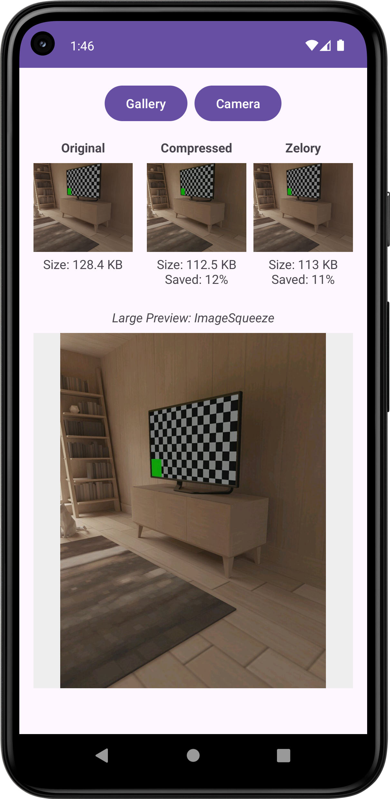
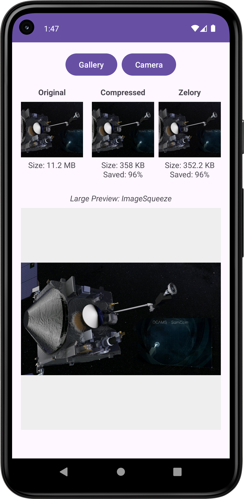

# 🗜️ ImageSqueeze

A **robust, crash-safe** Android image compression library built in Kotlin — designed as a modern, more resilient alternative to [Zelory Compressor](https://github.com/zetbaitsu/Compressor).


[](https://android-arsenal.com/api?level=21)
[](LICENSE)

---

### 📷 Visual Comparison
*(Left to Right: Original vs ImageSqueeze vs Zelory)*

<p align="center">
  
  
</p>

---

## ✨ Why ImageSqueeze?

| Feature | Zelory | ImageSqueeze |
|---|:---:|:---:|
| Coroutine-based async | ✅ | ✅ |
| DSL configuration | ✅ | ✅ |
| Resolution constraint | ✅ | ✅ |
| Quality constraint | ✅ | ✅ |
| File size constraint | ✅ | ✅ |
| Output format (JPEG/WEBP/PNG) | ✅ | ✅ |
| Typed error handling (`sealed class`) | ❌ | ✅ |
| Error type enum for programmatic action | ❌ | ✅ |
| OOM-safe bitmap decoding | Partial | ✅ |
| `FileNotFoundException` guard | ❌ | ✅ |
| `FileAlreadyExistsException` guard | ❌ | ✅ |
| `ENOSPC` (disk full) guard | ❌ | ✅ |
| Corrupt / unsupported image guard | ❌ | ✅ |
| EXIF rotation handling | ✅ | ✅ |
| Safe working-file cache pattern | ❌ | ✅ |
| Synchronous API | ❌ | ✅ |
| Kotlin `File` extension functions | ❌ | ✅ |

ImageSqueeze handles **all five known crash scenarios** from Zelory:

1. **`FileNotFoundException`** — source file missing, deleted, or inaccessible (Scoped Storage)
2. **`FileAlreadyExistsException`** — destination file cannot be overwritten/deleted
3. **`ENOSPC` (No space left on device)** — device storage full
4. **`OutOfMemoryError`** — image too large for available heap memory
5. **`BitmapFactory.decodeFile` returns null** — corrupt or unsupported image format

Instead of crashing, every error is returned as a **typed `SqueezeResult.Error`** that you can handle however you like (show a Toast, log analytics, retry, etc.).

---

## 📦 Installation

### Maven Central (Recommended)

ImageSqueeze is officially published on Maven Central. You do not need to add any custom repositories. Simply add the dependency to your app module:

<details open>
<summary><strong>Kotlin DSL</strong> (build.gradle.kts)</summary>

```kotlin
dependencies {
    implementation("io.github.kevinmf1:imagesqueeze:1.1.0")
}
```

</details>

<details>
<summary><strong>Groovy</strong> (build.gradle)</summary>

```groovy
dependencies {
    implementation 'io.github.kevinmf1:imagesqueeze:1.1.0'
}
```

</details>

---

### JitPack

Alternatively, you can get it via JitPack.

**Step 1.** Add the JitPack repository:

<details>
<summary><strong>Kotlin DSL</strong> (settings.gradle.kts)</summary>

```kotlin
dependencyResolutionManagement {
    repositories {
        // ...
        maven { url = uri("https://jitpack.io") }
    }
}
```

</details>

<details>
<summary><strong>Groovy</strong> (build.gradle / settings.gradle)</summary>

```groovy
// In settings.gradle (AGP 7+)
dependencyResolutionManagement {
    repositories {
        // ...
        maven { url 'https://jitpack.io' }
    }
}

// Or in root build.gradle (older projects)
allprojects {
    repositories {
        // ...
        maven { url 'https://jitpack.io' }
    }
}
```

</details>

**Step 2.** Add the dependency to your module:

<details>
<summary><strong>Kotlin DSL</strong> (build.gradle.kts)</summary>

```kotlin
dependencies {
    implementation("com.github.kevinmf1:ImageSqueeze:1.1.0")
}
```

</details>

<details>
<summary><strong>Groovy</strong> (build.gradle)</summary>

```groovy
dependencies {
    implementation 'com.github.kevinmf1:ImageSqueeze:1.1.0'
}
```

</details>

> Replace `1.1.0` with the latest release tag.

### Local Module

If you prefer to include it as a local module:

<details>
<summary><strong>Kotlin DSL</strong></summary>

```kotlin
// settings.gradle.kts
include(":imagesqueeze")

// app/build.gradle.kts
dependencies {
    implementation(project(":imagesqueeze"))
}
```

</details>

<details>
<summary><strong>Groovy</strong></summary>

```groovy
// settings.gradle
include ':imagesqueeze'

// app/build.gradle
dependencies {
    implementation project(':imagesqueeze')
}
```

</details>

---

## 🚀 Quick Start

### Basic Usage (Coroutine)

```kotlin
import vinz.android.imagesqueeze.ImageSqueeze
import vinz.android.imagesqueeze.SqueezeResult

lifecycleScope.launch {
    val result = ImageSqueeze.compress(context, sourceFile)

    when (result) {
        is SqueezeResult.Success -> {
            val compressedFile = result.file
            // Upload, display, or save the compressed file
        }
        is SqueezeResult.Error -> {
            Log.e("Compress", result.message)
            // Show user-friendly message, log analytics, etc.
        }
    }
}
```

### With Configuration DSL

```kotlin
val result = ImageSqueeze.compress(context, sourceFile) {
    resolution(1280, 720)       // Max width x height
    quality(85)                 // Starting JPEG quality (1–100)
    size(500_000L)              // Target max file size in bytes (500 KB)
    format(Bitmap.CompressFormat.WEBP) // Output format
}
```

### File Extension Syntax

For an even more concise API, use the Kotlin extension functions:

```kotlin
import vinz.android.imagesqueeze.extensions.squeeze

val result = sourceFile.squeeze(context) {
    resolution(1024, 1024)
    quality(80)
    size(1_000_000L) // 1 MB
}
```

### Custom Destination & Background Thread

By default, the compressed file is saved to the app's cache directory and runs on `Dispatchers.IO`. You can easily override the destination file and the Coroutines Dispatcher:

```kotlin
import kotlinx.coroutines.Dispatchers

val destination = File(getExternalFilesDir(null), "compressed_photo.jpg")

val result = ImageSqueeze.compress(
    context = context, 
    source = sourceFile, 
    destination = destination,
    dispatcher = Dispatchers.Default // Run on CPU-bound thread instead of IO
) {
    quality(75)
}
```

### 🖼️ Jetpack Compose Support

**Yes**, ImageSqueeze is fully compatible with Jetpack Compose natively because it is written cleanly in Kotlin Coroutines without any view-layer dependencies. Since Jetpack UI recompositions must remain non-blocking, you can easily use it alongside `rememberCoroutineScope`:

```kotlin
@Composable
fun CompressImageScreen(originalFile: File) {
    val context = LocalContext.current
    val coroutineScope = rememberCoroutineScope()
    var compressedResult by remember { mutableStateOf<SqueezeResult?>(null) }

    Button(onClick = {
        coroutineScope.launch {
            // Compress off the main thread smoothly
            compressedResult = originalFile.squeeze(context) {
                resolution(1024, 1024)
                quality(80)
            }
        }
    }) {
        Text("Compress Now")
    }

    // Handle states
    when (val res = compressedResult) {
        is SqueezeResult.Success -> Text("Saved ${res.file.length()} bytes!")
        is SqueezeResult.Error -> Text("Error: ${res.message}")
        null -> Text("Waiting to compress...")
    }
}
```

### Synchronous API

If you need to compress on a background thread you manage yourself:

```kotlin
// On your own background thread
val result = ImageSqueeze.compressSync(context, sourceFile) {
    quality(80)
}
```

---

## ⚙️ Configuration Options

All configuration is done through the `CompressionConfig` DSL block:

| Method | Type | Default | Description |
|---|---|---|---|
| `resolution(w, h)` | `Int, Int` | `612 × 816` | Maximum output width and height |
| `quality(q)` | `Int` | `80` | Starting JPEG/WEBP encode quality (1–100) |
| `size(bytes)` | `Long` | `1,000,000` (1 MB) | Maximum output file size in bytes |
| `format(fmt)` | `Bitmap.CompressFormat` | `JPEG` | Output format: `JPEG`, `WEBP`, `PNG` |
| `isForDisplay` | `Boolean` | `false` | If `true`, produces a 100×100 thumbnail |
| `minQuality` | `Int` | `10` | Minimum quality floor during iterative size reduction |

### Example: Full Configuration

```kotlin
val result = ImageSqueeze.compress(context, sourceFile) {
    resolution(1920, 1080)
    quality(90)
    size(2_000_000L)  // 2 MB
    format(Bitmap.CompressFormat.WEBP)
    minQuality = 20   // Don't go below quality 20
}
```

---

## 🛡️ Error Handling

ImageSqueeze **never throws unhandled exceptions**. Every failure is captured and returned as a `SqueezeResult.Error` with three useful properties:

```kotlin
sealed class SqueezeResult {
    data class Success(val file: File) : SqueezeResult()

    data class Error(
        val errorType: SqueezeError,    // Typed enum for programmatic branching
        val exception: Throwable?,      // Original exception for logging/debugging
        val message: String             // Human-readable message
    ) : SqueezeResult()
}
```

### Error Types

| `SqueezeError` | When It Occurs |
|---|---|
| `FILE_NOT_FOUND` | Source file does not exist or was deleted |
| `NOT_READABLE` | Source file exists but cannot be read (permissions) |
| `FILE_EMPTY` | Source file is 0 bytes |
| `NO_DISK_SPACE` | Less than 10 MB of free storage available |
| `DECODE_FAILED` | `BitmapFactory` returned null (corrupt/unsupported format) |
| `OUT_OF_MEMORY` | Image too large to decode into memory |
| `COPY_FAILED` | Could not write the result to the destination |
| `UNKNOWN` | Any other unexpected error |

### Handling Specific Errors

```kotlin
when (result) {
    is SqueezeResult.Success -> {
        uploadToServer(result.file)
    }
    is SqueezeResult.Error -> {
        when (result.errorType) {
            SqueezeError.FILE_NOT_FOUND -> showRetakePhotoDialog()
            SqueezeError.NO_DISK_SPACE  -> showClearStoragePrompt()
            SqueezeError.OUT_OF_MEMORY  -> showLowerResolutionHint()
            SqueezeError.DECODE_FAILED  -> showUnsupportedFormatMessage()
            else -> {
                logToAnalytics(result.exception)
                showGenericError(result.message)
            }
        }
    }
}
```

---

## 🏗️ Architecture

ImageSqueeze is split into clean, focused modules for readability and maintainability:

```
imagesqueeze/
├── ImageSqueeze.kt          # Public API entry point
├── CompressionConfig.kt     # DSL configuration class
├── SqueezeResult.kt         # Sealed result wrapper (Success / Error)
├── SqueezeError.kt          # Error type enum
├── core/
│   └── CompressorCore.kt    # Internal compression engine
├── utils/
│   ├── FileUtil.kt          # File I/O, disk space checks, safe copy/delete
│   └── ImageUtil.kt         # Bitmap decoding, EXIF rotation, safe recycle
└── extensions/
    └── FileExt.kt           # Kotlin File extension functions
```

---

## 🔬 How Compression Works

ImageSqueeze follows a battle-tested pipeline inspired by Zelory's approach, with added safety at every step:

1. **Validate** — Check source file exists, is readable, and is non-empty
2. **Disk space guard** — Verify at least 10 MB of free storage
3. **Copy to cache** — Work on a safe copy to prevent source corruption
4. **Decode with `inSampleSize`** — Downsample using power-of-2 scaling to prevent OOM
5. **EXIF rotation** — Read orientation tag and rotate bitmap accordingly
6. **Iterative quality reduction** — Encode at starting quality, then step down by 10 until the file size constraint is met or `minQuality` is reached
7. **Safe write** — Atomic write with temp file fallback if destination cannot be deleted
8. **Cleanup** — Delete working files from cache

---

## 🧪 Testing

ImageSqueeze ships with a comprehensive test suite to ensure reliability before every release. All tests pass with **0 failures**.

### Unit Tests (JVM — no device required)

Run with:

```bash
./gradlew :imagesqueeze:testDebugUnitTest
```

| Test Class | Tests | Scenarios Covered |
|---|:---:|---|
| `CompressionConfigTest` | 9 | Default values, `resolution()`, `format()`, `quality()`, `size()`, `minQuality`, `isForDisplay`, full DSL block |
| `SqueezeResultTest` | 6 | `Success` data access, `Error` with exception, `Error` with null exception, `when` exhaustiveness |
| `SqueezeErrorTest` | 4 | All 8 enum values present, `valueOf()` lookup, exhaustive `when` matching |
| `FileUtilTest` | 16 | `formatFileSize` (zero, negative, B, KB, MB, GB, fractional), `safeCopyFile` (same path, new dest, overwrite, nested dirs, missing source, source preservation), `safeDelete` (exists, non-existent) |
| `CompressorCoreTest` | 8 | `FILE_NOT_FOUND`, `FILE_EMPTY`, English error messages, non-null exception, suspend vs sync parity |
| `ImageSqueezeTest` | 7 | Public API error paths (`compress`/`compressSync`), DSL config passthrough, default destination |
| **Total** | **50** | |

### Instrumented Tests (requires device / emulator)

Run with:

```bash
./gradlew :imagesqueeze:connectedDebugAndroidTest
```

| Scenario | Tests | What is verified |
|---|:---:|---|
| Full compression pipeline | 10 | Valid JPEG → Success, custom quality, custom resolution, size constraint, PNG format, display thumbnail, auto-create dirs, source preservation, output ≤ original, default cache destination |
| Error handling | 4 | Non-existent file → `FILE_NOT_FOUND`, empty file → `FILE_EMPTY`, corrupt file → `DECODE_FAILED`, English-only messages |
| Extension functions | 2 | `File.squeeze()` success path + error path |
| `compressSync()` | 2 | Sync API with default and full DSL config |
| **Total** | **21** | |

> **Combined: 71 tests** covering configuration, validation guards, error handling, the full compression pipeline, and the public API surface.

---

## 📋 Requirements

- **Min SDK**: 21 (Android 5.0 Lollipop)
- **Kotlin**: 1.9+
- **Coroutines**: `kotlinx-coroutines-android`

---

## 📄 License

```
Copyright 2025 Kevin Malik Fajar

Licensed under the Apache License, Version 2.0 (the "License");
you may not use this file except in compliance with the License.
You may obtain a copy of the License at

    http://www.apache.org/licenses/LICENSE-2.0

Unless required by applicable law or agreed to in writing, software
distributed under the License is distributed on an "AS IS" BASIS,
WITHOUT WARRANTIES OR CONDITIONS OF ANY KIND, either express or implied.
See the License for the specific language governing permissions and
limitations under the License.
```

---

## 🤝 Contributing

Contributions are welcome! Please feel free to submit a Pull Request.

1. Fork the repository
2. Create your feature branch (`git checkout -b feature/amazing-feature`)
3. Commit your changes (`git commit -m 'Add some amazing feature'`)
4. Push to the branch (`git push origin feature/amazing-feature`)
5. Open a Pull Request

---

## 🙏 Acknowledgments

- Inspired by [Zelory Compressor](https://github.com/zetbaitsu/Compressor) — the original idea and compression pipeline
- Built with [Timber](https://github.com/JakeWharton/timber) for clean logging
